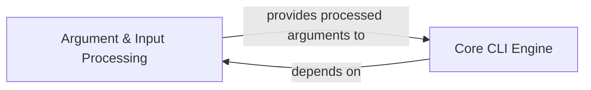

## Component Details

Overview of Argument & Input Processing component and its relations in a CLI project

### Argument & Input Processing

This component is responsible for the initial parsing and processing of raw command-line arguments. It intelligently separates flags from positional arguments and performs essential type conversion, transforming string inputs (e.g., "123", "True") into their appropriate Python types (`int`, `bool`, etc.). This preparation is critical as it provides structured and typed data directly to the `Core CLI Engine` for execution.

**Related Classes/Methods**:

- <a href="https://github.com/google/python-fire/blob/master/fire/parser.py#L26-L35" target="_blank" rel="noopener noreferrer">`fire.parser.CreateParser` (26:35)</a>

- <a href="https://github.com/google/python-fire/blob/master/fire/parser.py#L38-L55" target="_blank" rel="noopener noreferrer">`fire.parser.SeparateFlagArgs` (38:55)</a>

- <a href="https://github.com/google/python-fire/blob/master/fire/parser.py#L58-L75" target="_blank" rel="noopener noreferrer">`fire.parser.DefaultParseValue` (58:75)</a>

- <a href="https://github.com/google/python-fire/blob/master/fire/parser.py#L78-L115" target="_blank" rel="noopener noreferrer">`fire.parser._LiteralEval` (78:115)</a>

### Core CLI Engine

Core CLI Engine responsible for executing commands based on processed arguments.

**Related Classes/Methods**: _None_

### [FAQ](https://github.com/CodeBoarding/GeneratedOnBoardings/tree/main?tab=readme-ov-file#faq)