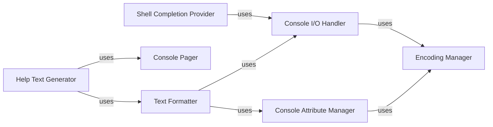

## Component Details

This subsystem is crucial for how the CLI interacts with the user, ensuring that information is presented clearly, comprehensively, and efficiently. It encompasses the generation of help documentation, intelligent shell auto-completion, and robust console management for output formatting and pagination.

### Help Text Generator

This component is responsible for dynamically generating comprehensive and well-formatted help text for CLI commands and their arguments. It leverages introspection of the CLI application's structure and docstring information to provide users with clear guidance on how to use the CLI.

**Related Classes/Methods**:

- <a href="https://github.com/google/python-fire/blob/master/fire/helptext.py#L1-L1" target="_blank" rel="noopener noreferrer">`fire.helptext` (1:1)</a>

### Shell Completion Provider

This component provides the logic for generating shell completion suggestions. It inspects the available commands, subcommands, and arguments of a Fire CLI application to offer intelligent auto-completion, significantly enhancing the user's interaction efficiency and reducing typing errors.

**Related Classes/Methods**:

- <a href="https://github.com/google/python-fire/blob/master/fire/completion.py#L1-L1" target="_blank" rel="noopener noreferrer">`fire.completion` (1:1)</a>

### Text Formatter

This component is responsible for applying various formatting styles (e.g., bolding, colors, indentation) to text before it is displayed in the console. It ensures that CLI output is readable, visually appealing, and highlights important information effectively. It may include platform-specific formatting considerations.

**Related Classes/Methods**:

- <a href="https://github.com/google/python-fire/blob/master/fire/formatting.py#L1-L1" target="_blank" rel="noopener noreferrer">`fire.formatting` (1:1)</a>

### Console Attribute Manager

This component manages console attributes such as text colors, background colors, and text styles (bold, underline). It provides an abstraction layer for applying these attributes, potentially handling platform-specific differences to ensure consistent visual output.

**Related Classes/Methods**:

- <a href="https://github.com/google/python-fire/blob/master/fire/console/console_attr.py#L1-L1" target="_blank" rel="noopener noreferrer">`fire.console.console_attr` (1:1)</a>

- <a href="https://github.com/google/python-fire/blob/master/fire/console/console_attr_os.py#L1-L1" target="_blank" rel="noopener noreferrer">`fire.console.console_attr_os` (1:1)</a>

### Console I/O Handler

This component manages the fundamental input and output operations with the console. It handles writing text to standard output and error streams, and potentially reading input. It's a core utility for any console-based application.

**Related Classes/Methods**:

- <a href="https://github.com/google/python-fire/blob/master/fire/console/console_io.py#L1-L1" target="_blank" rel="noopener noreferrer">`fire.console.console_io` (1:1)</a>

### Console Pager

This component handles the pagination of large text outputs, preventing information from scrolling off the screen too quickly. It integrates with external paging utilities (like `less` or `more`) to provide a controlled viewing experience for extensive help texts or command outputs.

**Related Classes/Methods**:

- <a href="https://github.com/google/python-fire/blob/master/fire/console/console_pager.py#L1-L1" target="_blank" rel="noopener noreferrer">`fire.console.console_pager` (1:1)</a>

### Encoding Manager

This component is responsible for managing character encoding for console input and output. It ensures that text is correctly encoded and decoded across different operating systems and locales, preventing display issues with special characters.

**Related Classes/Methods**:

- <a href="https://github.com/google/python-fire/blob/master/fire/console/encoding.py#L1-L1" target="_blank" rel="noopener noreferrer">`fire.console.encoding` (1:1)</a>

### [FAQ](https://github.com/CodeBoarding/GeneratedOnBoardings/tree/main?tab=readme-ov-file#faq)