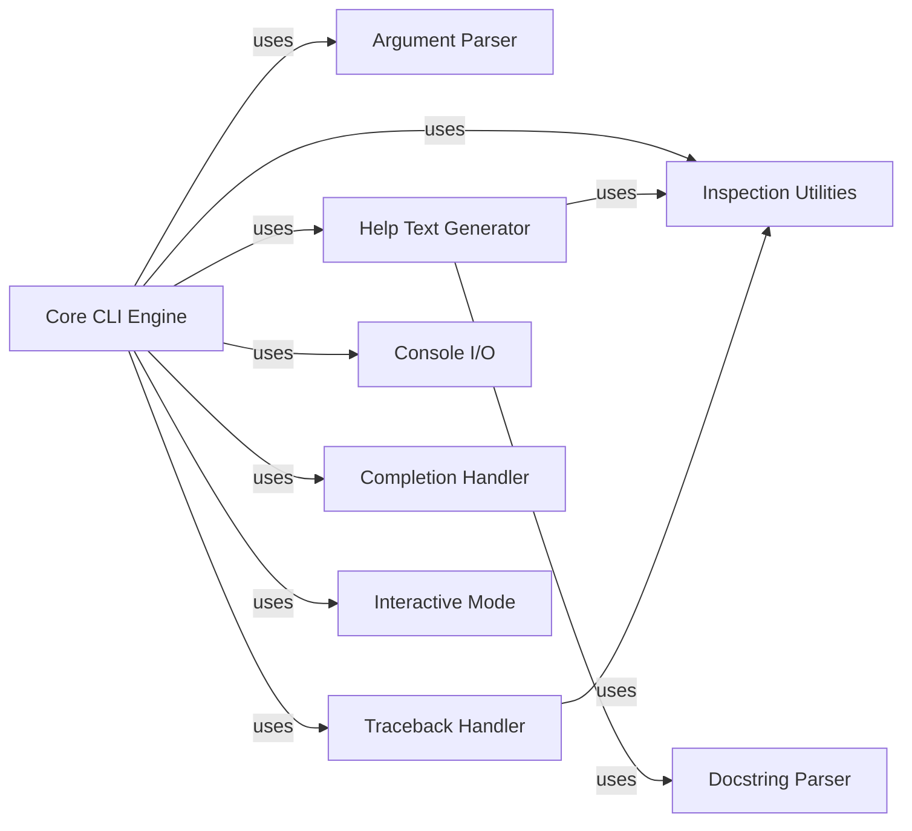

## Component Details

This analysis focuses on the `Core CLI Engine` subsystem within `python-fire`, which acts as the central orchestrator for transforming command-line inputs into Python object interactions. It dynamically dispatches commands, accesses properties, and manages the overall flow of the CLI application.

### Core CLI Engine

This is the central orchestrator and execution engine of `python-fire`. `fire.core.Fire` serves as the main entry point, handling initial argument parsing and delegating to `fire.core._Fire`. `fire.core._Fire` then recursively traverses the target Python object, dynamically calling methods, accessing properties, and instantiating classes based on the command-line arguments. It manages the entire lifecycle of a CLI command execution.

**Related Classes/Methods**:

- <a href="https://github.com/google/python-fire/blob/master/fire/core.py#L72-L163" target="_blank" rel="noopener noreferrer">`fire.core.Fire` (72:163)</a>

- <a href="https://github.com/google/python-fire/blob/master/fire/core.py#L360-L618" target="_blank" rel="noopener noreferrer">`fire.core._Fire` (360:618)</a>

### Argument Parser

Responsible for parsing raw command-line arguments. It separates flag arguments (e.g., `--help`, `--verbose`) from positional and keyword arguments, and prepares them for consumption by the `Core CLI Engine`. It uses Python's `argparse` module internally for flag handling.

**Related Classes/Methods**:

- <a href="https://github.com/google/python-fire/blob/master/fire/parser.py#L0-L0" target="_blank" rel="noopener noreferrer">`fire.parser` (0:0)</a>

- <a href="https://github.com/google/python-fire/blob/master/fire/parser.py#L38-L55" target="_blank" rel="noopener noreferrer">`fire.parser.SeparateFlagArgs` (38:55)</a>

- <a href="https://github.com/google/python-fire/blob/master/fire/parser.py#L26-L35" target="_blank" rel="noopener noreferrer">`fire.parser.CreateParser` (26:35)</a>

### Help Text Generator

Generates comprehensive and user-friendly help messages for CLI commands. This includes usage instructions, argument details, and descriptions, often derived from Python docstrings and object introspection.

**Related Classes/Methods**:

- <a href="https://github.com/google/python-fire/blob/master/fire/helptext.py#L0-L0" target="_blank" rel="noopener noreferrer">`fire.helptext` (0:0)</a>

- <a href="https://github.com/google/python-fire/blob/master/fire/helptext.py#L47-L90" target="_blank" rel="noopener noreferrer">`fire.helptext.HelpText` (47:90)</a>

### Inspection Utilities

Offers utilities for introspecting Python objects, functions, and classes. This includes retrieving metadata such as argument specifications, docstring information, file and line numbers, and determining object types (e.g., named tuples). This information is vital for dynamic command dispatch and help generation.

**Related Classes/Methods**:

- <a href="https://github.com/google/python-fire/blob/master/fire/inspectutils.py#L0-L0" target="_blank" rel="noopener noreferrer">`fire.inspectutils` (0:0)</a>

- <a href="https://github.com/google/python-fire/blob/master/fire/inspectutils.py#L313-L332" target="_blank" rel="noopener noreferrer">`fire.inspectutils.IsNamedTuple` (313:332)</a>

- <a href="https://github.com/google/python-fire/blob/master/fire/inspectutils.py#L210-L234" target="_blank" rel="noopener noreferrer">`fire.inspectutils.GetFileAndLine` (210:234)</a>

### Docstring Parser

Analyzes and extracts structured information from Python docstrings. It supports various docstring formats (e.g., Google, NumPy) to provide summaries, descriptions, and details about arguments, return values, and exceptions. This parsed information is primarily consumed by the `Help Text Generator`.

**Related Classes/Methods**:

- <a href="https://github.com/google/python-fire/blob/master/fire/docstrings.py#L0-L0" target="_blank" rel="noopener noreferrer">`fire.docstrings` (0:0)</a>

### Traceback Handler

Manages the recording and display of the execution path (trace) of a Fire command. It captures detailed information about accessed properties, function calls, and any errors encountered during execution, which is crucial for debugging and verbose output.

**Related Classes/Methods**:

- <a href="https://github.com/google/python-fire/blob/master/fire/trace.py#L0-L0" target="_blank" rel="noopener noreferrer">`fire.trace` (0:0)</a>

- <a href="https://github.com/google/python-fire/blob/master/fire/trace.py#L40-L237" target="_blank" rel="noopener noreferrer">`fire.trace.FireTrace` (40:237)</a>

### Console I/O

Handles all interactions with the console, including displaying output (e.g., command results, error messages, help text) and managing terminal attributes. This component abstracts away the complexities of cross-platform console communication.

**Related Classes/Methods**:

- `fire.console` (0:0)

- `fire.console.Display` (0:0)

- `fire.console._PrintResult` (0:0)

### Completion Handler

Provides functionality for generating shell tab-completion scripts. This allows users to auto-complete commands and arguments in their terminal, significantly improving the command-line experience.

**Related Classes/Methods**:

- <a href="https://github.com/google/python-fire/blob/master/fire/completion.py#L0-L0" target="_blank" rel="noopener noreferrer">`fire.completion` (0:0)</a>

- <a href="https://github.com/google/python-fire/blob/master/fire/completion.py#L0-L0" target="_blank" rel="noopener noreferrer">`fire.completion.CompletionScript` (0:0)</a>

### Interactive Mode

Enables an interactive Python REPL (Read-Eval-Print Loop) session when the `--interactive` flag is used. It embeds the current execution context, allowing users to inspect variables and interact with the CLI application's state directly.

**Related Classes/Methods**:

- <a href="https://github.com/google/python-fire/blob/master/fire/interact.py#L0-L0" target="_blank" rel="noopener noreferrer">`fire.interact` (0:0)</a>

- <a href="https://github.com/google/python-fire/blob/master/fire/interact.py#L25-L38" target="_blank" rel="noopener noreferrer">`fire.interact.Embed` (25:38)</a>

### [FAQ](https://github.com/CodeBoarding/GeneratedOnBoardings/tree/main?tab=readme-ov-file#faq)