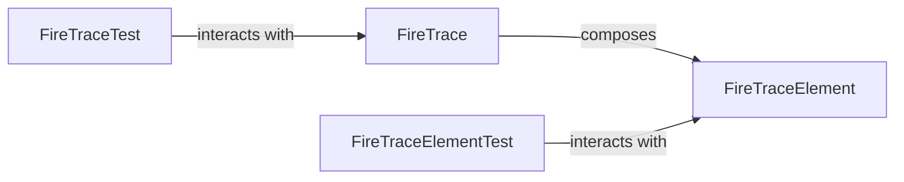

## Component Details

The `Execution Trace` component in the `fire` project is primarily responsible for recording and managing the detailed execution path and state of a Fire application. It serves as a crucial logging mechanism for debugging, error reporting, and providing context for other components.

### FireTrace

This class acts as the central ledger for recording the entire execution trace of a Fire command. It maintains an ordered list of `FireTraceElement` objects, each representing a distinct step or event in the command's execution. It provides a comprehensive API to add various types of events (e.g., accessed properties, called components, errors, completion scripts, interactive modes) and to retrieve critical information about the trace, such as the final result, error status, and the reconstructed command-line arguments. Its ability to reconstruct the command is vital for debugging and understanding the exact invocation that led to a particular state or error.

**Related Classes/Methods**:

- `FireTraceElement` (0:0)

### FireTraceElement

This class represents a single, atomic event or step within the `FireTrace`. It is the fundamental building block of the entire execution log. Each `FireTraceElement` encapsulates detailed information about a specific action, including the target of the action (e.g., a function, class, or property), its arguments, return value, associated filename and line number, and any errors or metadata. Its granular nature allows for a precise and detailed reconstruction of the application's execution flow.

**Related Classes/Methods**: _None_

### FireTraceTest

This class contains a suite of unit tests specifically designed to validate the correct behavior of the `FireTrace` class. It covers various scenarios, including initialization, result retrieval, error handling, and the proper addition and representation of different types of trace elements. This component ensures the reliability and accuracy of the `FireTrace` mechanism.

**Related Classes/Methods**:

- `FireTrace` (0:0)

### FireTraceElementTest

This class provides unit tests focused on verifying the functionality of the `FireTraceElement` class. It ensures that individual trace events are correctly stored, represented, and that methods like `HasError` and `__str__` behave as expected. This component is crucial for maintaining the integrity of the basic trace event unit.

**Related Classes/Methods**:

- `FireTraceElement` (0:0)

### [FAQ](https://github.com/CodeBoarding/GeneratedOnBoardings/tree/main?tab=readme-ov-file#faq)