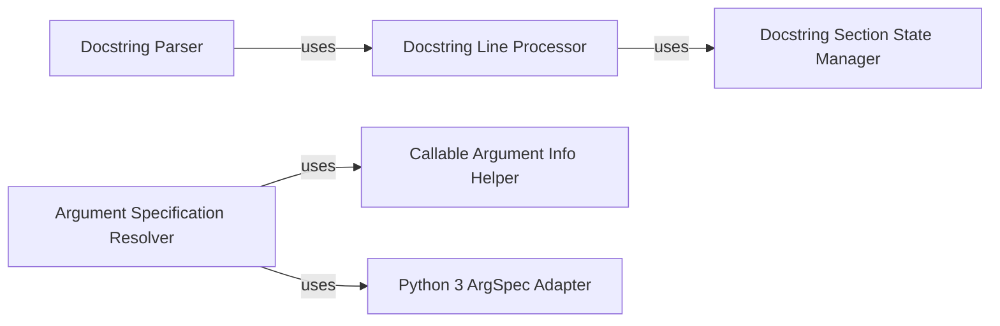

## Component Details

The `Object Introspection & Docstring Parsing` component in Python Fire is fundamental for dynamically understanding Python objects and their documentation. It enables Fire to automatically generate command-line interfaces and provide helpful usage information.

### Docstring Parser

This is the primary function responsible for analyzing and extracting structured information from Python docstrings. It supports Google, NumPy, and reStructuredText docstring formats, aiming for permissive parsing to handle variations. It produces a `DocstringInfo` object containing the summary, description, and details about arguments, return values, yields, and exceptions.

**Related Classes/Methods**:

- <a href="https://github.com/google/python-fire/blob/master/fire/docstrings.py#L117-L207" target="_blank" rel="noopener noreferrer">`fire.docstrings.parse` (117:207)</a>

### Docstring Line Processor

An internal helper function used by the `Docstring Parser` to process individual lines of a docstring. It updates the parsing state based on the line's content, identifying directives, argument names, types, and descriptions within different docstring sections.

**Related Classes/Methods**:

- <a href="https://github.com/google/python-fire/blob/master/fire/docstrings.py#L410-L506" target="_blank" rel="noopener noreferrer">`fire.docstrings._consume_line` (410:506)</a>

### Docstring Section State Manager

This internal helper function, called by `Docstring Line Processor`, determines the current section (e.g., "Args:", "Returns:") and the formatting style (Google, NumPy, and reStructuredText) of the docstring based on the current and surrounding lines. It updates the parser's state accordingly.

**Related Classes/Methods**:

- <a href="https://github.com/google/python-fire/blob/master/fire/docstrings.py#L532-L573" target="_blank" rel="noopener noreferrer">`fire.docstrings._update_section_state` (532:573)</a>

### Argument Specification Resolver

This function retrieves a detailed argument specification (`FullArgSpec`) for a given Python callable (function, method, or class). It handles various Python versions and edge cases, such as built-in functions and named tuples, to accurately determine the expected arguments.

**Related Classes/Methods**:

- <a href="https://github.com/google/python-fire/blob/master/fire/inspectutils.py#L162-L207" target="_blank" rel="noopener noreferrer">`fire.inspectutils.GetFullArgSpec` (162:207)</a>

### Callable Argument Info Helper

A helper function used by `Argument Specification Resolver` to determine if the first argument of a callable should be skipped (e.g., `self` for bound methods or `__init__` for classes) and which function's arg spec should be used for introspection.

**Related Classes/Methods**:

- <a href="https://github.com/google/python-fire/blob/master/fire/inspectutils.py#L49-L84" target="_blank" rel="noopener noreferrer">`fire.inspectutils._GetArgSpecInfo` (49:84)</a>

### Python 3 ArgSpec Adapter

This function provides a Python 3-specific implementation for retrieving the full argument specification. It leverages `inspect._signature_from_callable` to correctly handle bound arguments and follow wrapper chains, ensuring compatibility with modern Python features.

**Related Classes/Methods**:

- <a href="https://github.com/google/python-fire/blob/master/fire/inspectutils.py#L87-L157" target="_blank" rel="noopener noreferrer">`fire.inspectutils.Py3GetFullArgSpec` (87:157)</a>

### [FAQ](https://github.com/CodeBoarding/GeneratedOnBoardings/tree/main?tab=readme-ov-file#faq)