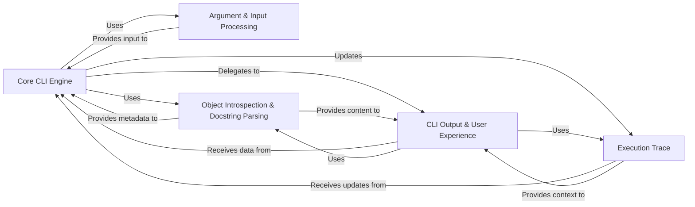

## Component Details

The `python-fire` library's architecture is elegantly designed around the concept of dynamically generating command-line interfaces from arbitrary Python objects. The analysis of the Control Flow Graph (CFG) and Source Analysis reveals a clear separation of concerns, with a central core orchestrating various specialized components for parsing, introspection, output, and state management. The five fundamental components are: Core CLI Engine, Argument & Input Processing, Object Introspection & Docstring Parsing, CLI Output & User Experience, and Execution Trace. These components cover the entire lifecycle of a Fire CLI: from receiving user input, understanding the target Python object, executing the desired action, managing the execution state, and finally, presenting information back to the user.

### Core CLI Engine

This is the central orchestrator and execution engine of `python-fire`. It takes a Python object and command-line arguments, then dynamically dispatches commands, accesses properties, and manages the overall flow of the CLI application. It encompasses the high-level control of `fire.core.Fire` and the recursive object traversal logic of `fire.core._Fire`.

**Related Classes/Methods**:

- <a href="https://github.com/google/python-fire/blob/master/fire/core.py#L72-L163" target="_blank" rel="noopener noreferrer">`fire.core.Fire` (72:163)</a>

- <a href="https://github.com/google/python-fire/blob/master/fire/core.py#L360-L618" target="_blank" rel="noopener noreferrer">`fire.core._Fire` (360:618)</a>

### Argument & Input Processing

This component is responsible for parsing raw command-line arguments. It separates flags from positional arguments and converts string inputs into appropriate Python types (e.g., "123" to `int`, "True" to `bool`), preparing them for the Core CLI Engine.

**Related Classes/Methods**:

- <a href="https://github.com/google/python-fire/blob/master/fire/parser.py#L0-L0" target="_blank" rel="noopener noreferrer">`fire.parser` (0:0)</a>

### Object Introspection & Docstring Parsing

This component provides the foundational capability to dynamically inspect Python objects (modules, classes, functions) to extract their structure, argument specifications, and docstring content. This information is critical for Fire's auto-CLI generation and for producing informative help messages.

**Related Classes/Methods**:

- <a href="https://github.com/google/python-fire/blob/master/fire/inspectutils.py#L0-L0" target="_blank" rel="noopener noreferrer">`fire.inspectutils` (0:0)</a>

- <a href="https://github.com/google/python-fire/blob/master/fire/docstrings.py#L0-L0" target="_blank" rel="noopener noreferrer">`fire.docstrings` (0:0)</a>

### CLI Output & User Experience

This component manages all aspects of how the CLI interacts with the user and presents information. This includes generating comprehensive help text, providing shell completion suggestions, handling paginated output for large texts, and applying formatting (bolding, colors) to enhance readability.

**Related Classes/Methods**:

- <a href="https://github.com/google/python-fire/blob/master/fire/helptext.py#L0-L0" target="_blank" rel="noopener noreferrer">`fire.helptext` (0:0)</a>

- <a href="https://github.com/google/python-fire/blob/master/fire/completion.py#L0-L0" target="_blank" rel="noopener noreferrer">`fire.completion` (0:0)</a>

- `fire.console` (0:0)

- <a href="https://github.com/google/python-fire/blob/master/fire/formatting.py#L0-L0" target="_blank" rel="noopener noreferrer">`fire.formatting` (0:0)</a>

### Execution Trace

This is a dedicated component for recording the detailed execution path and state of a Fire application. It captures accessed properties, called functions, and any errors, serving as a crucial log for debugging, error reporting, and providing context for other components like help generation.

**Related Classes/Methods**:

- <a href="https://github.com/google/python-fire/blob/master/fire/trace.py#L0-L0" target="_blank" rel="noopener noreferrer">`fire.trace` (0:0)</a>

### [FAQ](https://github.com/CodeBoarding/GeneratedOnBoardings/tree/main?tab=readme-ov-file#faq)